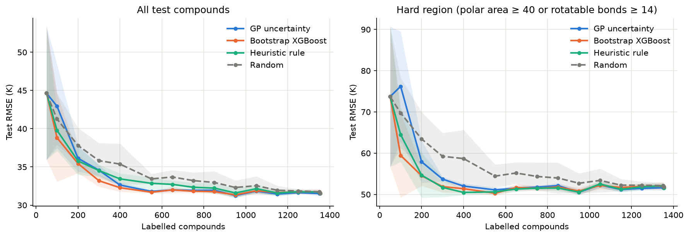
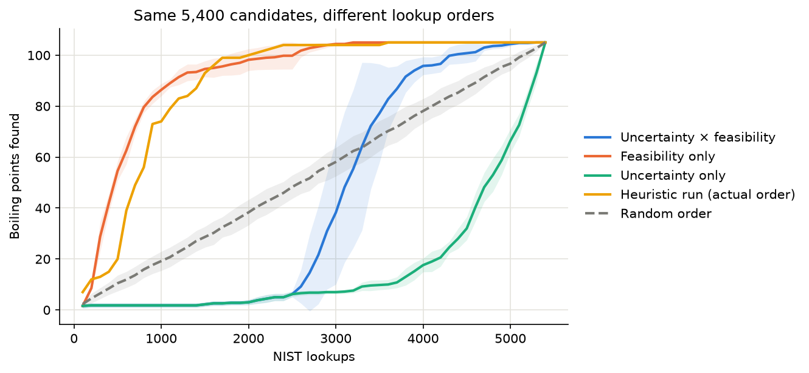
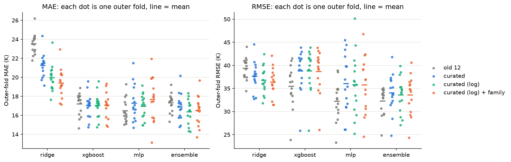
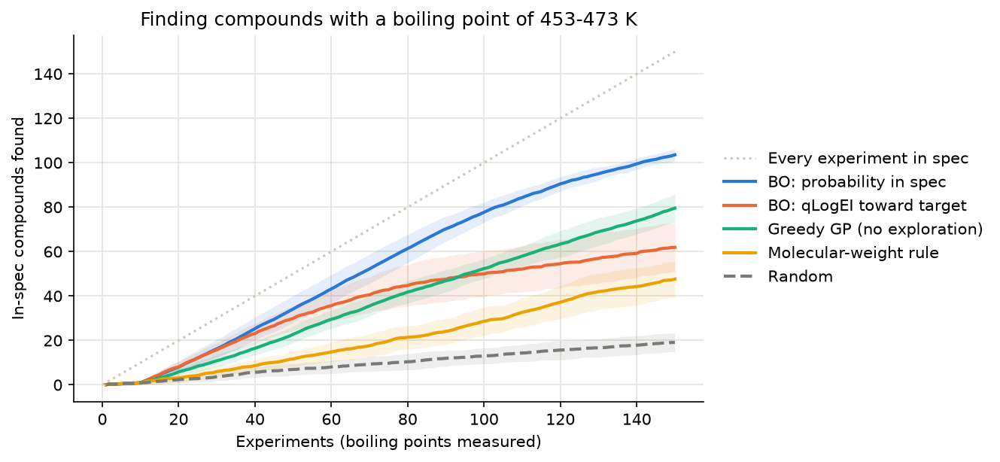

# Predict Organic Chemical Boiling Point

[](https://github.com/JShi12/Predict-Organic-Chemical-Boiling-Point/actions/workflows/ci.yml)


An end-to-end machine learning project for predicting the normal boiling point of organic compounds from molecular structure and physicochemical properties. The repository covers data collection, feature engineering, model comparison, ensemble regression, error analysis, targeted dataset expansion from the NIST Chemistry WebBook, active learning to decide which compounds to measure next, a rigorous re-evaluation with curated RDKit descriptors and nested cross-validation, an audit of which boiling-point labels are real measurements, and Bayesian optimisation to find compounds that meet a specification with as few experiments as possible.

The benchmark uses 1,588 literature compounds and reports results in kelvin. An audit found that 327 of those labels are group-contribution *estimates* rather than measurements, plus a handful of wrong values. On the 1,251 measured labels, nested family-stratified cross-validation gives **about 10.7 K mean absolute error (≈22 K RMSE)**. The project is designed as a reproducible cheminformatics experiment, not as a substitute for experimental measurements.


## Table of Contents

- [Introduction](#introduction)
- [Project Structure](#project-structure)
- [Data](#data)
- [Setup & Usage](#setup--usage)
- [Methodology](#methodology)
- [Results](#results)
- [Feature Importance](#feature-importance)
- [Active Learning: Which Compounds to Measure Next](#active-learning-which-compounds-to-measure-next)
- [Rich Features and Nested Cross-Validation](#rich-features-and-nested-cross-validation)
- [Label Audit: Which Boiling Points Are Real Measurements?](#label-audit-which-boiling-points-are-real-measurements)
- [Bayesian Optimisation: Finding Compounds That Meet a Spec](#bayesian-optimisation-finding-compounds-that-meet-a-spec)
- [Conclusions & Future Work](#conclusions--future-work)
- [License](#license)

## Introduction

The project has five parts, each with its own notebook:

| Notebook | Question | Key result |
|---|---|---|
| [`Boiling_Point_Predictor.ipynb`](Boiling_Point_Predictor.ipynb) | Which classic model predicts boiling point best? | Five architectures perform comparably, so a Ridge + XGBoost + neural-network ensemble is used. Test RMSE ≈26 K, but on an unusually easy split (see part 3). |
| [`Active_Learning.ipynb`](Active_Learning.ipynb) | Which compounds should be measured next? | Model-chosen labels reach random picking's accuracy with ~27–47% fewer labels. A feasibility-aware NIST round found 105 new boiling points in 302 lookups, against 3,553 for the hand-written rule. |
| [`Boiling_Point_RDKit.ipynb`](Boiling_Point_RDKit.ipynb) | Do physically motivated descriptors help, measured without split luck? | Nested, family-stratified CV gives ~16.4 K MAE (~33 K RMSE) on all labels. Curated RDKit descriptors win by MAE but lose by RMSE, because of ~20 extreme compounds. |
| [`Label_Audit.ipynb`](Label_Audit.ipynb) | Which labels are real measurements? | 327 labels are Joback group-contribution estimates (identical to the formula to 0.01 K), which run 100–250 K too high for large molecules; 10 more are wrong or implausible. On the 1,251 measured labels the curated descriptors win clearly: **~10.7 K MAE**. |
| [`Bayesian_Optimisation.ipynb`](Bayesian_Optimisation.ipynb) | How few experiments find the compounds that meet a spec? | For a 453–473 K window, BO (probability of meeting the spec, batches of 5) finds 69% of all in-spec compounds after measuring 12% of candidates: 5.4× random, better than every alternative in 20/20 seeds. |

**Summary of results:**
- **Original pipeline:** since all five architectures showed comparable validation performance (confirmed with a split-sensitivity analysis — repeating the comparison across many resampled splits), a simple-averaging **ensemble of Ridge, XGBoost, and a Neural Network** is used instead of a single "champion" model. On the original 60/20/20 split it scored an RMSE of ≈26 K, MAE ≈15 K and R² 0.95 on the held-out test set.
- **Re-evaluation:** repeated, family-stratified cross-validation with tuning inside each fold later showed that split was unusually easy: the same kind of ensemble scores ≈32 K RMSE (≈17 K MAE) averaged over 15 folds.
- **Label audit:** a fifth of the labels turned out to be estimates. With them removed, curated RDKit descriptors and an ensemble reach **≈10.7 K MAE (≈22 K RMSE)** on measured boiling points, and that is the figure to quote.

## Project Structure

```
.
├── Boiling_Point_Predictor.ipynb   # main analysis notebook (narrative + EDA)
├── Active_Learning.ipynb           # which compounds to measure next: GP-driven active learning
├── Boiling_Point_RDKit.ipynb       # fresh start: curated RDKit descriptors, nested family-stratified CV
├── Label_Audit.ipynb               # which labels are measurements? audit + re-evaluation on measured labels
├── Bayesian_Optimisation.ipynb     # batch BO campaigns to find compounds in a boiling-point spec window
├── src/boiling_point/              # reusable pipeline code
│   ├── data.py                     # loading & merging datasets
│   ├── features.py                 # SMILES feature engineering, feature/target selection
│   ├── preprocessing.py            # train/val/test split, scaling
│   ├── models.py                   # GridSearchCV training & evaluation per architecture
│   ├── evaluation.py               # split-sensitivity checks, multi-model evaluation helpers
│   ├── ensemble.py                 # simple-averaging ensemble across model families
│   ├── viz.py                      # shared plotting functions
│   ├── active_learning.py          # GP / bootstrap selectors, simulated labelling campaigns
│   ├── descriptors.py              # curated RDKit descriptors grouped by intermolecular force
│   ├── families.py                 # primary chemical family from RDKit substructure patterns
│   ├── validation.py               # nested, family-stratified CV of modelling recipes
│   ├── audit.py                    # label audit: Joback estimates, implausible hydrocarbons
│   ├── bayes_opt.py                # spec-window BO: probability-in-spec and qLogEI batch acquisition
│   └── nist_scraper.py             # NIST WebBook scraper for extending the dataset
├── scripts/
│   ├── scrape_nist_boiling_points.py       # CLI entry point for the NIST scraper (heuristic rule)
│   ├── run_active_learning_simulation.py   # retrospective active-learning benchmark
│   ├── run_model_driven_nist_round.py      # real NIST rounds with model-chosen compounds
│   ├── replay_nist_lookups.py              # replay the heuristic run's lookups in other orders
│   ├── evaluate_nist_additions.py          # do the added compounds improve the ensemble?
│   ├── run_feature_study.py                # nested CV: old 12 vs curated RDKit features (--audited)
│   ├── audit_labels.py                     # writes data/label_audit.csv
│   ├── run_bo_campaign.py                  # BO campaigns vs baselines, 20 seeds
│   └── build_pubchem_subset.py             # rebuild data/pubchem_subset.csv from the full download
├── tests/                          # unit tests for src/boiling_point
├── results/                       # simulation results (CSV) and exported plots (images/)
├── compound_boiling_points_from_literature.xlsx
├── data/pubchem_subset.csv       # every PubChem row the project uses (committed, 1.1 MB)
├── data/label_audit.csv          # audit outcome per flagged label (+ nist_audit_lookups.csv)
├── compound_property_from_PubChem.csv   # full download, not committed (optional) — see Data below
├── requirements.txt
├── LICENSE
└── .github/workflows/ci.yml
```

## Data

1. **PubChem** — `compound_property_from_PubChem.csv` was downloaded from [PubChem](https://pubchem.ncbi.nlm.nih.gov/), a trusted chemical database, and contains 324,628 records. String-type columns were manually dropped from the raw download to reduce file size.
2. **Literature** — `compound_boiling_points_from_literature.xlsx` was sourced from a [published academic journal article](https://pubs.acs.org/doi/10.1021/acs.jchemed.3c01040) and contains 1,748 records with high-quality boiling point measurements.

The two datasets are merged on compound name, giving **1,588 entries** used for modeling.

> **Note:** `compound_property_from_PubChem.csv` (~77MB) is not committed to this repository due to its size — it's listed in `.gitignore`. You don't need it to run anything: [`data/pubchem_subset.csv`](data/pubchem_subset.csv) (1.1 MB, 12,364 rows) holds every PubChem row the notebooks and scripts use (all compounds with boiling points, plus the NIST candidate pool), and `boiling_point.data.load_pubchem_data` falls back to it automatically. Results are identical either way. The full file is only needed to rebuild the subset (`scripts/build_pubchem_subset.py`) or to search candidates outside it; to get it, download it from PubChem, select the columns `cid, cmpdname, mw, mf, polararea, hbonddonor, hbondacc, rotbonds, heavycnt, isosmiles, charge`, and place it at the repo root.

### Extending the Dataset

The error analysis below shows compounds with high polar area and/or rotatable bonds are underrepresented and disproportionately account for the largest prediction errors. `scripts/scrape_nist_boiling_points.py` looks up boiling points for exactly that region on the [NIST Chemistry WebBook](https://webbook.nist.gov/chemistry/) — a public, experimentally-measured reference source — for PubChem candidates not already in `compound_boiling_points_from_literature.xlsx`.

```bash
python scripts/scrape_nist_boiling_points.py [output_csv]
```

This is a long-running, network-bound script (NIST's `robots.txt` crawl-delay is 5 seconds, and most candidates need 1-2 requests), so it can take several hours for the full candidate pool. Progress is written to the output CSV incrementally, and reruns automatically resume by skipping compound names already recorded there. It's not affiliated with, maintained by, or endorsed by NIST.

## Setup & Usage

```bash
git clone https://github.com/JShi12/Predict-Organic-Chemical-Boiling-Point.git
cd Predict-Organic-Chemical-Boiling-Point

python3.11 -m venv venv          # Python 3.11+ (BoTorch needs >= 3.10)
source venv/bin/activate          # on Windows: venv\Scripts\activate
pip install -r requirements.txt

# no data download needed: data/pubchem_subset.csv is used automatically (see Data above)

jupyter notebook Boiling_Point_Predictor.ipynb   # or Active_Learning.ipynb / Boiling_Point_RDKit.ipynb
```

Run the test suite:

```bash
pytest tests/
```

## Methodology

* **Approach**
  1. Split the data into training/validation/test (60/20/20).
  2. Cross-validate and tune hyperparameters on the training set with `GridSearchCV` for each candidate architecture.
  3. Compare the tuned models on the validation set — and check, via repeated resampling, whether any architecture is reliably better rather than just luckier on one split.
  4. Re-train the chosen model architecture on training + validation data, then evaluate it on the held-out test set.

* **Five architectures evaluated:** Linear Regression (Ridge), Random Forest, XGBoost, Neural Network (MLP), Support Vector Regression.

* **Feature engineering:** in addition to PubChem physicochemical properties (molecular weight, polar area, H-bond donor/acceptor counts, rotatable bonds, heavy atom count), simple atom/bond-count features (`C_cnt`, `O_cnt`, `N_cnt`, `side_chain_cnt`, `double_bond_cnt`, `triple_bond_cnt`) were derived from each compound's isomeric SMILES string.

* The dataset contains outliers — a small number of compounds with high molecular weight, polar area, and/or rotatable bond count. These were kept rather than removed, since the model should be able to predict for those real (if rare) cases too.

## Results

| Model | Train RMSE (K) | Validation RMSE (K) |
|---|---|---|
| Linear Regression (Ridge) | 37.1 | 47.9 |
| Random Forest | 39.5 | 52.5 |
| XGBoost | 35.7 | 49.0 |
| Neural Network | 29.5 | 45.3 |
| Support Vector Regression | 38.4 | 51.1 |

All models show higher validation error than training error, indicating some overfitting. The **Neural Network** actually achieves the lowest error on *both* the training and validation sets here — though its train→validation gap (15.7 K) is the largest of the five, making it the least stable of the models tested on this particular split.

A repeated-resampling check (refitting each architecture's tuned hyperparameters across 10 different train/val splits by changing the random_state seed) shows the mean ± std validation RMSE ranges overlap substantially across all five architectures — none of the differences above are large relative to the spread, so picking a single "champion" would largely reflect which rows landed in the validation set on this one split, not a real difference in architecture quality. Instead, a **simple-averaging ensemble of Ridge, XGBoost, and the Neural Network** is used — one representative of each genuinely different inductive bias (linear/regularized, tree/boosting, nonlinear), which is what makes averaging predictions useful rather than just noise. Random Forest is left out as redundant with XGBoost (same tree-based family, and XGBoost had the edge in most single-split comparisons); SVR is left out for being the least stable across splits (highest variance, ±6.6 K vs ±3.3-5.3 K for the others) despite a competitive mean.

The ensemble was fit on the combined training + validation set, then evaluated on the untouched test set:

| Metric | Value |
|---|---|
| 5-fold CV RMSE (train+val) | 35.7 K |
| **Test RMSE** | **26.2 K** |
| Test MAE | 15.2 K |
| Test R² | 0.95 |


> **Later re-evaluation:** repeated, family-stratified cross-validation with tuning inside each fold ([Rich Features and Nested Cross-Validation](#rich-features-and-nested-cross-validation)) puts this kind of ensemble at ≈32 K RMSE / ≈17 K MAE. That's the more reliable figure; the 26 K test RMSE reflects an easy split.

The test RMSE being lower than the CV RMSE is the same "easy test set" pattern seen throughout this project — with a dataset of only ~1,588 compounds, results are noticeably sensitive to the random split. Among the largest prediction errors, the affected compounds tend to have unusually large polar area and/or rotatable bond counts — the same outlier region noted during EDA. The notebook explores this dataset-size sensitivity further with a learning curve, an alternative split-ratio experiment, and a targeted data-collection effort (105 additional compounds scraped from the NIST Chemistry WebBook specifically in that outlier region).

## Feature Importance

The XGBoost component of the ensemble has a built-in feature importance (mean decrease in impurity), which highlights molecular weight, oxygen atom count, and hydrogen bond donor count as the strongest predictors of boiling point:


| Feature | Importance |
|---|---|
| Molecular weight (`mw`) | 0.539 |
| Oxygen atom count (`O_cnt`) | 0.184 |
| H-bond donor count (`hbonddonor`) | 0.072 |
| Polar area (`polararea`) | 0.071 |
| Side-chain count (`side_chain_cnt`) | 0.038 |
| Rotatable bonds (`rotbonds`) | 0.028 |

This is consistent with chemistry theory: molecular weight drives Van der Waals forces, while polarity and oxygen content drive hydrogen bonding and dipole-dipole attraction — the major intermolecular forces governing boiling point.

## Active Learning: Which Compounds to Measure Next

The dataset extension above chose compounds with a hand-written rule (polar area ≥ 40 or rotatable bonds ≥ 14). [`Active_Learning.ipynb`](Active_Learning.ipynb) tests whether letting a model choose improves the ensemble faster. It uses a retrospective simulation: start from 50 random labels out of the 1,693, reveal more in rounds chosen by each strategy, and retrain the Ridge + XGBoost + NN ensemble at checkpoints. Scoring is on a fixed test set stratified on the hard region, over 10 seeds.

Strategies: **random**, the **heuristic rule**, **GP uncertainty** (BoTorch `SingleTaskGP` with an ARD kernel and conditioned greedy batches), and a **bootstrap XGBoost** ensemble (15 bootstrapped models, picking where they disagree most).



| To match random's test RMSE at 550 labels | Labels needed | Saving |
|---|---|---|
| Bootstrap XGBoost | ~290 | ~47% |
| GP uncertainty | ~360 | ~35% |
| Heuristic rule | ~400 | ~27% |

- **Choosing which compounds to label pays off.** Between ~200 and ~550 labels every non-random strategy beats random; at 400 labels the GP and bootstrap selectors beat random on all 10 seeds. Seed-to-seed spread also drops from ±2.7 K to ≤ ±0.7 K.
- **The models rediscover the rule.** Without being told about the hard region, both model-driven selectors spend 50–70% of their labels there (random: 22%). In the hard region the heuristic matches the best model.
- **The bootstrap XGBoost ensemble was the best selector**, slightly ahead of the GP. Uncertainty-only GP sampling first chases chemical extremes (ozone, deuterated methane, tetranitromethane), which leaves it *behind* random at 100 labels. A calibration check suggests why. The GP's uncertainty mostly measures distance from labelled compounds (Spearman ρ ≈ 0.8 with distance) and underestimates how much harder the hard region is (~2.3× vs the real ~3×). The bootstrap spread tracks where the ensemble is actually wrong (ρ ≈ 0.6 with its error by 400 labels, vs 0.5 for the GP).
- **The hard region has a ~50 K error floor.** From ~400 labels on, hard-region RMSE stays at 50–52 K for every strategy, all the way to the full pool. With these 12 features, more of the same kind of data doesn't fix it (see Conclusions).

Reproduce with `python scripts/run_active_learning_simulation.py` (~10 min on 9 cores).

### Real NIST rounds: model-chosen compounds

`scripts/run_model_driven_nist_round.py` repeats the NIST collection with a model choosing what to look up. It draws from 10,776 PubChem candidates with no region filter and stops at 105 found boiling points, to match the heuristic run.

| Run | Lookups | Found | Hit rate | Lookups to reach 105 |
|---|---|---|---|---|
| Heuristic rule (earlier run) | 5,400 | 105 | 1.9% | 3,553 |
| Uncertainty only | 811 | 4 | 0.5% | not reached (stopped) |
| **Uncertainty × predicted feasibility** | 311 | 108 | **34.7%** | **302** |

- **Uncertainty alone picks compounds that can't be measured.** Its picks were large drug- and dye-like molecules (median molecular weight ~478 vs ~222 for the pool) that decompose before boiling, so NIST has no value.
- **Weighting by predicted feasibility fixes that.** The chance a lookup succeeds is very predictable from the same features (XGBoost classifier, cross-validated AUC 0.93). Weighting uncertainty by it found 105 new boiling points in 302 lookups, **~12× fewer** than the heuristic run needed.
- **Replay of the heuristic run's 5,400 recorded lookups** (no NIST requests; `scripts/replay_nist_lookups.py`):
  - ordering by feasibility alone reaches 50 hits in ~520 lookups, against ~2,610 in random order;
  - the heuristic run's own order did well (~800) because it followed PubChem compound ID order, and low IDs are common, well-studied compounds;
  - uncertainty × feasibility falls into a cold-start trap when its classifier starts with almost no hits.



- **The model found the dataset's blind spot: halogenated compounds.** 69% of its 105 are halogenated, against 0 of the 1,588 literature compounds, and the 12 features have no halogen counts. Neither set of additions measurably changes the literature test RMSE (all 95% intervals include zero; `scripts/evaluate_nist_additions.py`), because that test set has no halogenated compounds. On held-out model-chosen compounds, though, adding the other half cuts the error from ~82 K to ~23 K (6/6 splits) without hurting the literature benchmark.

## Rich Features and Nested Cross-Validation

[`Boiling_Point_RDKit.ipynb`](Boiling_Point_RDKit.ipynb) redoes the modelling from scratch:
- **Features:** curated RDKit descriptors, grouped by the intermolecular force each one tracks (size, branching/shape, hydrogen bonding, unsaturation, composition), plus a variant with log-transformed size and shape descriptors.
- **Evaluation:** nested cross-validation stratified by chemical family (5 folds × 3 repeats, tuning inside each training fold).
- **Selection:** by **MAE**, with RMSE reported alongside. RMSE squares each error, so a few extreme compounds can decide the winner.
- **Data:** the 1,588 literature compounds minus the two likely data-entry errors.



Paired comparison on the same 15 folds (ensemble, feature set minus the original 12 features):

| Ensemble (Ridge + XGBoost + MLP) | MAE change | RMSE change |
|---|---|---|
| Curated RDKit descriptors | −0.4 K (better in 12/15 folds) | +1.8 K (better in 4/15) |
| Curated, log size/shape | **−1.0 K** (better in 13/15 folds) | +1.3 K |

- **~16.4 K MAE (~33 K RMSE) on all labels.** The final model (curated log descriptors + ensemble, chosen by MAE) is a near-tie with the original 12 features + MLP, which RMSE prefers.
- **The curated descriptors win by MAE and for three of four families, but lose by RMSE.** The RMSE gap comes entirely from ~20 extreme compounds; without them the curated features are better (27.1 vs 28.1 K). The [label audit](#label-audit-which-boiling-points-are-real-measurements) shows these are mostly bad labels.
- **The dataset is narrow.** It has only four acyclic families of C/H/N/O (alcohols, alkanes, alkenes/alkynes, amines), so many descriptors are constant. One global model beats per-family models, and adding the family as an input doesn't help.
- **The richer features resolve most isomer ties:** from 224 groups sharing identical features down to 71, of which 64 are stereoisomers.
- **A descriptor bug was caught and fixed:** `Kappa3` is undefined below 4 heavy atoms (RDKit returns −27 for methanol). Fixing it reversed an earlier conclusion that the log transform hurt.

## Label Audit: Which Boiling Points Are Real Measurements?

[`Label_Audit.ipynb`](Label_Audit.ipynb) checks every label without using model predictions as evidence:

| Check | Flagged | Excluded |
|---|---|---|
| **Label identical to its Joback group-contribution estimate** (198.2 K + fixed amounts per group), to 0.01 K; fewer than one such match is expected by chance | 327 | 327 |
| **Hydrocarbon more than 80 K below the n-alkane with the same carbon count** (99% sit within 40 K); likely reduced-pressure values | 7 | 7 |
| **NIST WebBook value for compounds every model mispredicts** in the same direction: 3 labels contradicted (87–155 K too low), 1 confirmed, the rest not in NIST | 30 | 3 (2 already counted above) |
| Data-entry errors found earlier | 2 | 2 |

That leaves **1,251 measured labels**. Joback estimates are fairly accurate for small molecules but overshoot by 100–250 K beyond ~20 heavy atoms, exactly where the models kept "underpredicting".

| On measured labels (nested CV, paired) | MAE | RMSE |
|---|---|---|
| Curated ensemble | **10.8 K** (vs 12.9 K for the original 12; better in 15/15 folds) | 22.5 K |
| Best recipes | ~10.7 K | ~22 K |

- **Cleaner training data helps on its own.** On the *same* measured compounds, the curated ensemble's MAE is 14.0 K when trained with the suspect labels and 10.8 K without them, despite ~20% less training data.
- **The lesson:** the biggest single improvement in the project came from finding which labels were real, not from better models or features.

## Bayesian Optimisation: Finding Compounds That Meet a Spec

In formulation work the question is usually "which candidates meet the specification?", not "what's the maximum?". [`Bayesian_Optimisation.ipynb`](Bayesian_Optimisation.ipynb) sets up that problem:
- **Spec:** a boiling point of **453–473 K** (180–200 °C). 151 of the 1,251 measured compounds are in spec, at molecular weights from 62 to 354, so no simple size rule finds them.
- **Campaign:** each "experiment" reveals one measured boiling point. 10 random starting experiments, then **batches of 5**, up to 150 experiments, repeated over 20 seeds.
- **Model:** a BoTorch `SingleTaskGP` on the curated RDKit descriptors.



| After 150 experiments (20 seeds) | In-spec found (of 151) | vs random |
|---|---|---|
| **BO: probability of meeting the spec** (batch built with the kriging-believer trick) | **103.6 ± 2.6** | **5.4×** |
| Greedy GP (same model, no exploration) | 79.6 ± 6.3 | 4.2× |
| BO: BoTorch qLogEI toward 463 K | 61.9 ± 10.9 | 3.2× |
| Molecular-weight rule | 47.6 ± 8.2 | 2.5× |
| Random | 19.1 ± 4.1 | 1.0× |

- **Probability-in-spec BO wins in all 20 seeds.** It finds 69% of the in-spec compounds after measuring 12% of the candidates, about the work of ~850 random experiments.
- **Exploration is worth ~24 compounds:** the greedy GP uses the same model but ignores uncertainty.
- **The acquisition must match the goal.** qLogEI toward the target is fastest at first, then stalls: it chases ever-closer matches to 463 K instead of collecting everything inside the window.
- **Blind spot:** BO rarely finds in-spec compounds in a *different* region of chemical space from those already found, here small diols (ethylene glycol, propylene glycol), which boil like molecules twice their size.

## Conclusions & Future Work

1. Five classic ML models were evaluated for predicting chemical compound boiling points on a dataset of 1,588 entries. Model performance was found to be sensitive to the train/validation/test split, given the modest dataset size — collecting more data is recommended as a follow-up. Since no single architecture was reliably better than the others, a simple-averaging ensemble of Ridge, XGBoost, and a Neural Network is used instead of a single champion model.
2. Feature selection is naturally embedded in the training process of the XGBoost component of the ensemble; the dominant features are molecular weight, oxygen atom count, H-bond donor count, polar area, side-chain count, and rotatable bond count.
3. To further improve model performance, collecting more data — particularly compounds with large polar area and/or rotatable bond counts — is recommended for re-training.
4. Cross-referencing the recurring large-residual outlier compounds against independent sources surfaced likely data-entry errors of roughly 90–100 K in two of them, both understating boiling point: 2,6-Nonadien-1-ol (369.65 K here vs 469.15 K per PubChem's WHO/FAO JECFA citation) and N-Methyldodecylamine (382.15 K here vs 473.15 K per a commercial chemical supplier site). At least part of this dataset's hardest-to-predict cases may reflect mislabeled training data rather than genuine chemical difficulty — a full audit against primary sources is recommended alongside collecting more data.
5. Active learning shows that choosing which compounds to label reaches the same accuracy with ~27–47% fewer labels than random picking, and that the hand-written hard-region rule captures most of that benefit. It also shows that hard-region error plateaus at ~50 K no matter how many of the existing compounds are labelled. This qualifies point 3: richer molecular descriptors and a label audit are likely to matter more than more compounds described by the same 12 features.
6. Real NIST collection rounds show that active learning in the real world must model feasibility: uncertainty alone chose compounds that decompose before boiling (0.5% hit rate), while weighting by a learned chance of success found 105 new boiling points in 302 lookups (35%). The model-chosen compounds covered chemistry the literature data lacks entirely (halogenated molecules), cutting error there from ~82 K to ~23 K. A benchmark drawn from the original data can't show that kind of gain, so the acquisition target should match the population the model will be used on.
7. Redoing the modelling with nested, family-stratified CV and MAE-based selection gives ~16.4 K MAE (~33 K RMSE) on all labels. Curated RDKit descriptors win by MAE but lose by RMSE, because of ~20 extreme compounds.
8. A label audit found that 327 labels (21%) are Joback group-contribution estimates, not measurements, and 10 more are wrong or implausible. On the 1,251 measured labels, the curated descriptors win clearly (ensemble MAE 10.8 vs 12.9 K, 15/15 folds), and training without the suspect labels improves accuracy on the same compounds by ~3 K MAE. For future work on this dataset, start from `data/label_audit.csv`.
9. Bayesian optimisation turns the model into an experiment planner. Choosing batches by the probability of meeting a boiling-point spec finds 69% of the in-spec compounds after measuring 12% of the candidates (5.4× random). Using the model without its uncertainty, or with an acquisition aimed at a single target value, finds far fewer.

## License

This project is licensed under the [MIT License](LICENSE).
