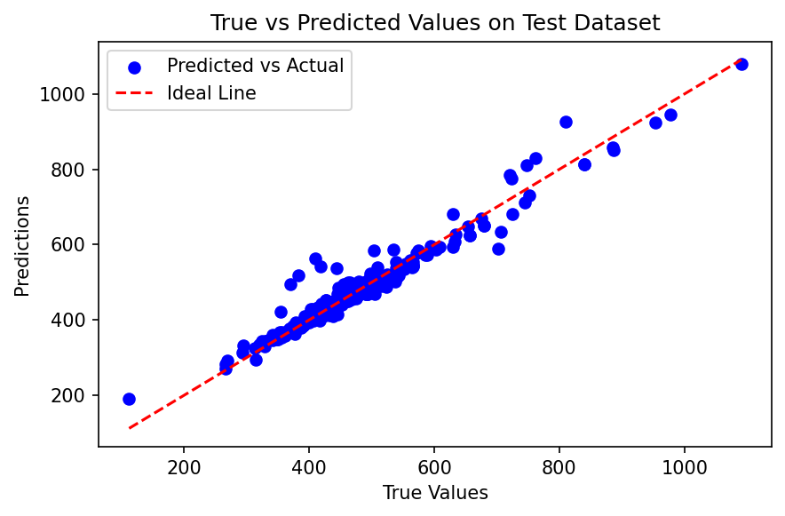
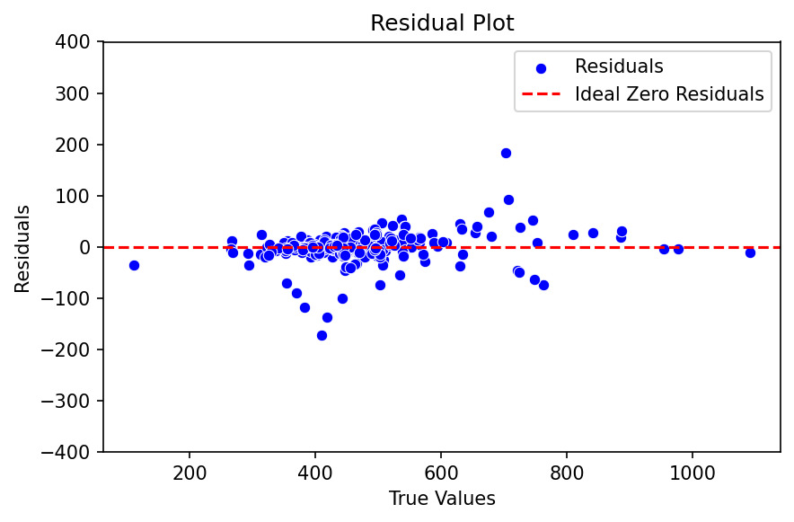
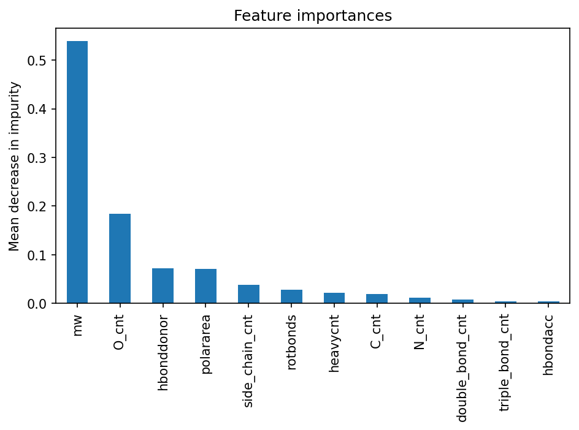

# Predict Organic Chemical Boiling Point


Predicting the boiling point of organic chemical compounds from their molecular structure and physicochemical properties, using classic ML regression models.



## Table of Contents

- [Introduction](#introduction)
- [Project Structure](#project-structure)
- [Data](#data)
- [Setup & Usage](#setup--usage)
- [Methodology](#methodology)
- [Results](#results)
- [Feature Importance](#feature-importance)
- [Conclusions & Future Work](#conclusions--future-work)
- [License](#license)

## Introduction

This project goes through a full ML project cycle: data collection, data pre-processing and feature engineering, model training and validation, and model evaluation. Five classic ML architectures — Linear Regression (Ridge), Random Forest, XGBoost, Neural Network, and Support Vector Regression — were trained and evaluated for predicting the boiling point of organic chemical compounds.

**Summary of results:** An XGBoost model was selected as the champion architecture. Retrained on the combined training + validation data, it achieved an RMSE of ≈39 K (cross-validated), and evaluated on the held-out test set it achieved an RMSE of ≈27 K, MAE of ≈15 K, and R² of 0.94.

## Project Structure

```
.
├── Boiling_Point_Predicter.ipynb   # main analysis notebook (narrative + EDA)
├── src/boiling_point/              # reusable pipeline code
│   ├── data.py                     # loading & merging datasets
│   ├── features.py                 # SMILES feature engineering, feature/target selection
│   ├── preprocessing.py            # train/val/test split, scaling
│   ├── models.py                   # GridSearchCV training & evaluation per architecture
│   ├── evaluation.py               # split-sensitivity checks, multi-model evaluation helpers
│   ├── viz.py                      # shared plotting functions
│   └── nist_scraper.py             # NIST WebBook scraper for extending the dataset
├── scripts/
│   └── scrape_nist_boiling_points.py   # CLI entry point for the NIST scraper
├── tests/                          # unit tests for src/boiling_point
├── results/images/                 # exported result plots (used in this README)
├── compound_boiling_points_from_literature.xlsx
├── compound_property_from_PubChem.csv   # not committed — see Data below
├── requirements.txt
├── LICENSE
└── .github/workflows/ci.yml
```

## Data

1. **PubChem** — `compound_property_from_PubChem.csv` was downloaded from [PubChem](https://pubchem.ncbi.nlm.nih.gov/), a trusted chemical database, and contains 324,628 records. String-type columns were manually dropped from the raw download to reduce file size.
2. **Literature** — `compound_boiling_points_from_literature.xlsx` was sourced from a [published academic journal article](https://pubs.acs.org/doi/10.1021/acs.jchemed.3c01040) and contains 1,748 records with high-quality boiling point measurements.

The two datasets are merged on compound name, giving **1,588 entries** used for modeling.

> **Note:** `compound_property_from_PubChem.csv` (~77MB) is not committed to this repository due to its size — it's listed in `.gitignore`. To reproduce this project, download it from PubChem and select the columns `cmpdname, mw, mf, polararea, hbonddonor, hbondacc, rotbonds, heavycnt, isosmiles, charge`, then place it at the repo root (`boiling_point.data.load_pubchem_data` handles the column selection automatically).

### Extending the Dataset

The error analysis below shows compounds with high polar area and/or rotatable bonds are underrepresented and disproportionately account for the largest prediction errors. `scripts/scrape_nist_boiling_points.py` looks up boiling points for exactly that region on the [NIST Chemistry WebBook](https://webbook.nist.gov/chemistry/) — a public, experimentally-measured reference source — for PubChem candidates not already in `compound_boiling_points_from_literature.xlsx`.

```bash
python scripts/scrape_nist_boiling_points.py [output_csv]
```

This is a long-running, network-bound script (NIST's `robots.txt` crawl-delay is 5 seconds, and most candidates need 1-2 requests), so it can take several hours for the full candidate pool. Progress is written to the output CSV incrementally, and reruns automatically resume by skipping compound names already recorded there. It's not affiliated with, maintained by, or endorsed by NIST.

## Setup & Usage

```bash
git clone https://github.com/JShi12/Predict-Organic-Chemical-Boiling-Point.git
cd Predict-Organic-Chemical-Boiling-Point

python -m venv venv
source venv/bin/activate          # on Windows: venv\Scripts\activate
pip install -r requirements.txt

# place compound_property_from_PubChem.csv at the repo root (see Data above)

jupyter notebook Boiling_Point_Predicter.ipynb
```

Run the test suite:

```bash
pytest tests/
```

## Methodology

* **Approach**
  1. Split the data into training/validation/test (60/20/20).
  2. Cross-validate and tune hyperparameters on the training set with `GridSearchCV` for each candidate architecture.
  3. Compare the tuned models on the validation set and select the champion architecture.
  4. Retrain the champion model on training + validation data, then evaluate it on the held-out test set.

* **Five architectures evaluated:** Linear Regression (Ridge), Random Forest, XGBoost, Neural Network (MLP), Support Vector Regression.

* **Feature engineering:** in addition to PubChem physicochemical properties (molecular weight, polar area, H-bond donor/acceptor counts, rotatable bonds, heavy atom count), simple atom/bond-count features (`C_cnt`, `O_cnt`, `N_cnt`, `side_chain_cnt`, `double_bond_cnt`, `triple_bond_cnt`) were derived from each compound's isomeric SMILES string.

* The dataset contains outliers — a small number of compounds with high molecular weight, polar area, and/or rotatable bond count. These were kept rather than removed, since the model should be able to predict for those real (if rare) cases too.

## Results

| Model | Train RMSE (K) | Validation RMSE (K) |
|---|---|---|
| Linear Regression (Ridge) | 37.1 | 47.9 |
| Random Forest | 39.5 | 52.5 |
| **XGBoost (champion)** | 35.7 | 49.0 |
| Neural Network | 29.5 | 45.3 |
| Support Vector Regression | 38.4 | 51.1 |

All models show higher validation error than training error, indicating some overfitting. In this run, the **Neural Network** actually achieves the lowest error on *both* the training and validation sets — though its train→validation gap (15.7 K) is the largest of the five, making it the least stable of the models tested. **XGBoost** was selected as the champion architecture instead: its validation performance is close behind the Neural Network, but it is less sensitive to feature scaling and outliers, and its built-in feature importances give a directly interpretable view of which chemical properties drive boiling point (see [Feature Importance](#feature-importance) below). As the split-sensitivity note below illustrates, model rankings on this dataset shift with the specific train/validation/test split given its modest size (1,588 compounds) — re-running with a different split can change which model comes out ahead.

The champion XGBoost model was retrained on the combined training + validation set, then evaluated on the untouched test set:

| Metric | Value |
|---|---|
| Cross-validated RMSE (train+val) | 39.0 K |
| **Test RMSE** | **26.9 K** |
| Test MAE | 15.4 K |
| Test R² | 0.94 |



The test RMSE being lower than the training RMSE is a signal that this particular train/val/test split happened to produce a comparatively "easy" test set — with a dataset of only ~1,588 compounds, results are noticeably sensitive to the random split. Among the largest prediction errors, the affected compounds tend to have unusually large polar area and/or rotatable bond counts — the same outlier region noted during EDA.

## Feature Importance

XGBoost's built-in feature importance (mean decrease in impurity) highlights molecular weight, oxygen atom count, and hydrogen bond donor count as the strongest predictors of boiling point:



| Feature | Importance |
|---|---|
| Molecular weight (`mw`) | 0.539 |
| Oxygen atom count (`O_cnt`) | 0.184 |
| H-bond donor count (`hbonddonor`) | 0.072 |
| Polar area (`polararea`) | 0.071 |
| Side-chain count (`side_chain_cnt`) | 0.038 |
| Rotatable bonds (`rotbonds`) | 0.028 |

This is consistent with chemistry theory: molecular weight drives Van der Waals forces, while polarity and oxygen content drive hydrogen bonding and dipole-dipole attraction — the major intermolecular forces governing boiling point.

## Conclusions & Future Work

1. Five classic ML models were evaluated for predicting chemical compound boiling points on a dataset of 1,588 entries. Model performance was found to be sensitive to the train/validation/test split, given the modest dataset size — collecting more data is recommended as a follow-up. XGBoost performed best overall.
2. Feature selection is naturally embedded in XGBoost's training process; the dominant features are molecular weight, oxygen atom count, H-bond donor count, polar area, side-chain count, and rotatable bond count.
3. To further improve model performance, collecting more data — particularly compounds with large polar area and/or rotatable bond counts — is recommended for re-training.

## License

This project is licensed under the [MIT License](LICENSE).
